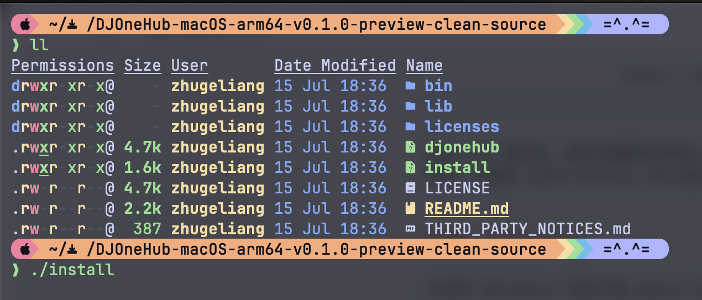
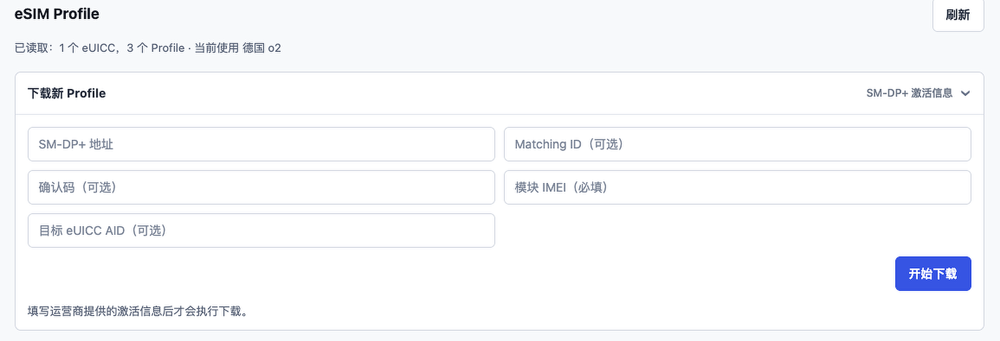
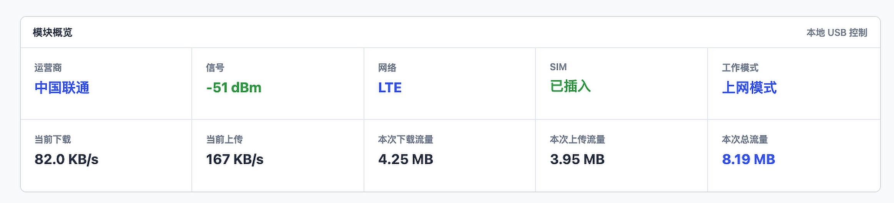
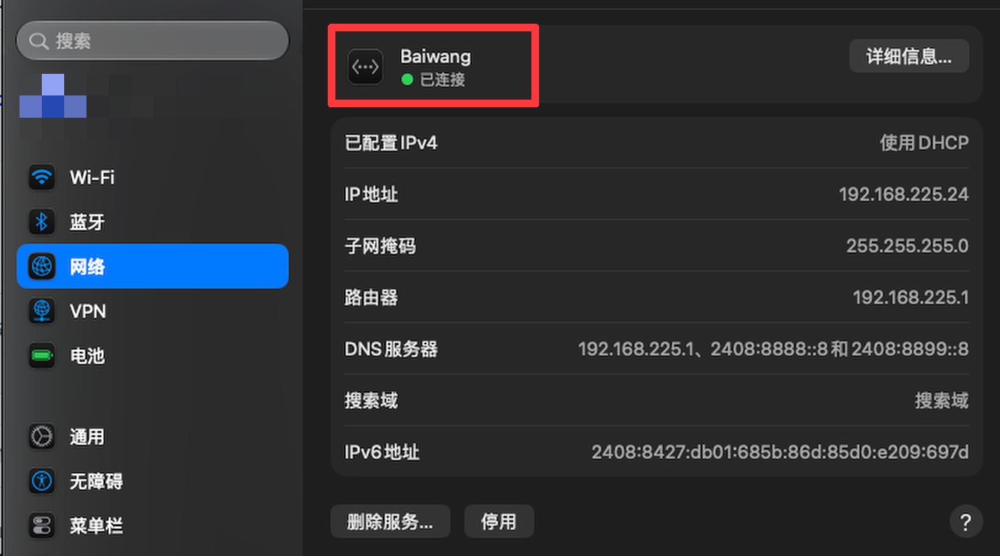
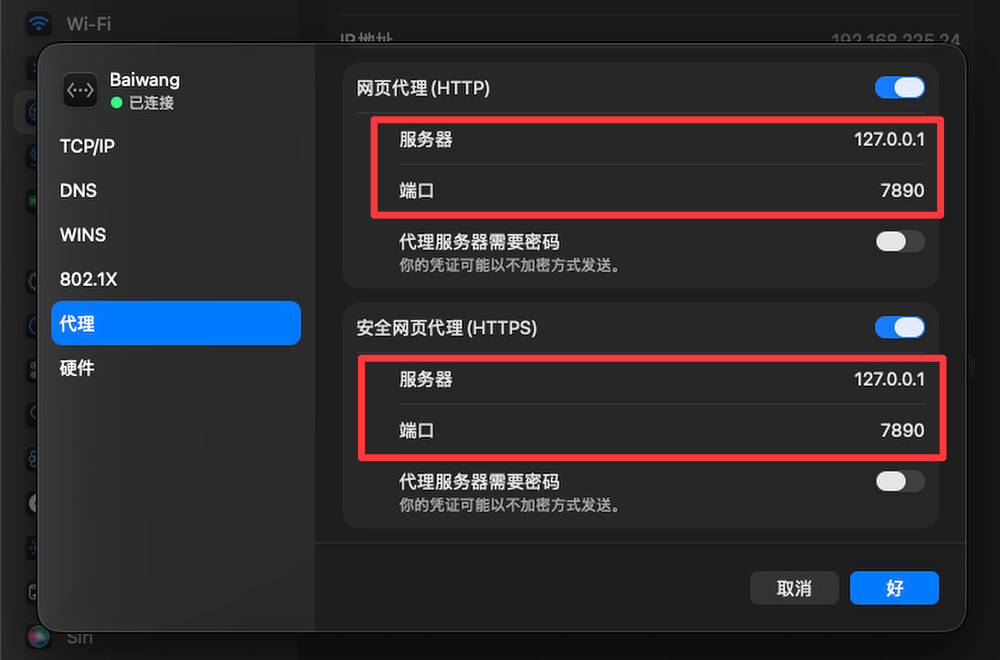

# ModemCat

ModemCat 是一款面向**大疆第一代 4G 模块和合宙 Air780 系列**的第三方 WebUI 管理工具。它通过 USB 与模块现有接口通信，让模块无需虚拟机即可在 Mac 上完成短信收发、模块状态查询、AT 指令调试和兼容固件的 USB 4G 上网。项目只提供浏览器管理页面和本地后台进程，不包含原生 macOS `.app` 或菜单栏界面。

程序及管理页面均在本机运行，默认只监听 `127.0.0.1:7575`，不会主动把 SIM、短信或卡片资料上传到远程服务器。

> [!WARNING]
> ModemCat 是 breaking change。它只读取 `~/Library/Application Support/ModemCat`，不会迁移或兼容旧项目的数据、环境变量、命令路径与后台服务标识。

> [!IMPORTANT]
> ModemCat 是非官方第三方项目，与 DJI、Quectel、运营商及 eSIM 卡片厂商不存在隶属、授权或合作关系。

## 功能概览

| 功能 | 状态 | 说明 |
| --- | --- | --- |
| 模块自动识别 | 已实现 | 识别大疆第一代 4G 模块及 Air780 的 AT、LSAT、AUAT 固件，并处理拔出、重新连接和换卡 |
| 模块状态 | 已实现 | 显示运营商、信号、网络制式、SIM 状态和当前工作模式 |
| 短信管理 | 已实现 | 接收、发送、自动轮询、验证码提取及模块旧短信清理 |
| 定时短信 | 已实现 | 按天数和本地时间周期发送，支持启停、立即执行、失败次日重试和执行历史 |
| 来电提醒 | 已实现 | WebUI 显示来电、未接及中断记录，并可安全拒接当前来电 |
| 转发渠道 | 已实现 | Bark、Telegram、企业微信、钉钉、飞书、Server 酱、PushPlus、ntfy、Gotify、自定义 Webhook；同类型可配多条，默认全部关闭 |
| 浏览器提醒 | 已实现 | WebUI 打开时通过浏览器通知显示实时事件 |
| 登录保护 | 已实现 | 首次启动设置管理员账号，密码以 bcrypt 哈希保存，会话仅保留在内存中 |
| eSIM Profile | 已实现 | 读取、下载、启用、改名和删除兼容 eUICC 卡片中的 Profile |
| Profile 号码资料 | 已实现 | 将手动填写的号码保存到模块通讯录，并按 ICCID 关联 Profile |
| USB 4G 上网 | 已实现 | 切换 USB 网卡模式，让 macOS 使用 SIM 卡流量上网 |
| 网络与流量 | 已实现 | 查看 USB 网卡、默认出口、代理连通性、实时速度和本次流量 |
| AT 调试 | 已实现 | 在网页中直接向模块发送 AT 指令 |
| 深浅色外观 | 已实现 | 支持浅色、深色和跟随系统 |
| Intel Mac | 尚未发布 | 当前预览发行包仅提供 Apple Silicon 版本 |

## 接入准备

### 硬件

- 大疆第一代 4G 模块，或合宙 Air780 系列模块
- 可正常使用的实体 SIM，或与当前实现兼容的实体 eUICC/eSIM 卡片
- 支持数据传输的 USB-C 线缆
- Apple Silicon Mac

大疆模块的 USB 设备标识通常为 `2ca3:4006`，Air780 默认是 `19d1:0001`。Air780 自定义过 VID/PID 时仍可通过已出现的 AT 串口连接，也可用 `-port` 显式指定。如果连接后 macOS 完全没有发现 USB 设备，请优先确认线缆支持数据传输。

### 系统

- macOS 13 Ventura 或更新版本
- 当前发行包支持 Apple Silicon，即 M1、M2、M3、M4 及后续 Apple 芯片
- Intel Mac 版本尚未发布和真机验证

发行包已经携带运行所需的 `libusb`。普通用户不需要安装 Homebrew、Go、Node.js 或其他开发环境。

### 指示灯

| 状态 | 常见含义 |
| --- | --- |
| 红色常亮 | 未插入 SIM 卡 |
| 红色闪烁 | SIM 卡未被正常识别 |
| 绿色常亮 | SIM 已识别，蜂窝信号通常较好 |
| 绿色闪烁 | SIM 已识别，蜂窝信号可能较弱或仍在注册 |

不同固件的灯光行为可能存在差异，最终应以网页中的 SIM、信号和网络注册状态为准。

## 接入原理

大疆第一代 4G 模块通过不同的 USB 组合模式向 macOS 暴露管理接口或网络接口。ModemCat 没有修改模块固件，而是根据模块现有 USB 接口实现本机通信，并预设了常用的短信模式和上网模式。

`AT+QCFG="usbnet"` 决定模块以哪种协议向主机暴露网络接口：

| 模式 | 协议 | 页面名称 | 说明 |
| --- | --- | --- | --- |
| 模式 0 | QMI / RMNET | 短信模式 | 高通私有协议，macOS 无对应驱动，因此不会出现网卡。适合读取状态、收发短信、管理 eSIM 和发送 AT 指令 |
| 模式 1 | CDC-ECM | 上网模式 | USB 标准以太网，macOS 免驱识别为网卡，可用 SIM 流量上网 |
| 模式 2 | MBIM | 不提供 | USB-IF 的蜂窝专用标准，Windows 原生支持；macOS 无原生驱动，本项目未验证 |
| 模式 3 | RNDIS | 不提供 | 微软的 USB 以太网方案，Windows 与安卓原生支持；macOS 无原生驱动，本项目未验证 |

界面只提供模式 0 和模式 1。模式 2、3 在 macOS 上大概率得不到可用网卡，而切换后如果 AT 通路也受影响，就可能既上不了网也切不回来。确有需要可在“AT 调试”页执行 `AT+QCFG="usbnet",2` 并重启模块，但请先确认你知道如何切回。

切换模式时，模块会重新枚举 USB 接口，页面可能短暂显示设备断开。请等待系统重新识别，不要在 eSIM Profile 写入等关键操作过程中拔出模块或切换模式。

### Air780 多固件

ModemCat 会从模块身份和版本响应中自动识别 Air780 型号与固件后缀，不要求手工选择：

| 固件后缀 | USB 端口 | USB 上网 | ModemCat 行为 |
| --- | --- | --- | --- |
| `_AT` | 3 个 | RNDIS / ECM | 状态、短信、AT 调试可用；macOS 上网使用 `AT+SETUSB=2` 的 ECM 模式 |
| `_LSAT` | 2 个 | 不支持 | 状态、短信、AT 调试可用；页面不会把缺少网卡误报成故障 |
| `_AUAT` | 2 个 | 不支持 | 状态、短信、AT 调试可用；保留固件自身的音频文件播放能力 |

Air780 的 `AT+SETUSB=1` 是 RNDIS，`AT+SETUSB=2` 是 ECM，与 Quectel 的 `AT+QCFG="usbnet"` 数值含义不同。ModemCat 会先识别模块厂商，再选择对应命令，并在写入后读取校验。

## 下载

请前往项目的 **Releases** 页面，下载文件名中包含 `macOS-arm64` 的 ZIP 发行包。

Release 页面还会提供同名的 `.sha256` 文件。它不是程序的一部分，也不是安装必需文件，仅用于确认 ZIP 是否下载完整、是否与发布者生成的文件一致。

GitHub 自动生成的 `Source code (zip)` 和 `Source code (tar.gz)` 是源码快照，适合开发者阅读和构建，不能替代已经打包好的 macOS 发行包。

验证 ZIP 时，在下载目录执行：

```sh
shasum -a 256 ModemCat-*.zip
```

将输出与 `.sha256` 文件中的值比较即可。

## 安装

### 一键安装（推荐）

```sh
curl -fsSL https://raw.githubusercontent.com/SuInk/modemcat/main/scripts/install.sh | sh
```

脚本会查询最新版本、下载 macOS-arm64 发行包、**校验 SHA-256**、解压并完成安装。校验不通过或该版本没有提供校验文件时会直接中止——以管道方式执行的脚本没有第二道防线，这一步不跳过。

安装指定版本：

```sh
curl -fsSL https://raw.githubusercontent.com/SuInk/modemcat/main/scripts/install.sh | MODEMCAT_VERSION=v0.1.0 sh
```

> [!TIP]
> 介意把远程脚本直接交给 shell 执行的话，先下载下来读一遍再运行：
> ```sh
> curl -fsSL -o install.sh https://raw.githubusercontent.com/SuInk/modemcat/main/scripts/install.sh
> less install.sh && sh install.sh
> ```

### 手动安装

1. 完整解压下载的 ZIP，不要只从压缩包中拖出单个文件。
2. 打开 macOS“终端”。
3. 输入 `cd `，在 `cd` 后保留一个空格。
4. 把解压得到的 ModemCat 文件夹拖入终端窗口，然后按回车。
5. 执行安装命令：

```sh
./install
```



安装过程中，macOS 可能要求输入当前用户的管理员密码。输入密码时终端不会显示圆点或星号，这是正常现象。

程序主体会安装到：

```text
/usr/local/libexec/modemcat
```

终端命令入口会创建在：

```text
/usr/local/bin/modemcat
```

安装完成后，无论终端当前位于哪个目录，都可以直接使用 `modemcat` 命令。

## 首次启动

1. 先将 SIM 或 eUICC 卡片插入模块。
2. 使用支持数据传输的 USB-C 线连接模块与 Mac。
3. 等待 macOS 完成 USB 设备枚举。
4. 在终端中启动 ModemCat：

```sh
modemcat start
```

程序会自动打开本机管理页面：

```text
http://127.0.0.1:7575
```

首次打开会进入“设置管理员账号”页面。账号为 3 到 64 位，可使用字母、数字、点、下划线和连字符；密码至少 12 字节。设置完成后，设备状态、短信、eSIM、网络和提醒 API 都必须登录才能访问。

启动程序的终端需要保持运行。按 `Control+C` 可以停止程序。如果浏览器没有自动打开，可以执行：

```sh
modemcat open
```

需要登录后自动在后台运行时，可以执行：

```sh
modemcat service install
```

查看或移除后台服务：

```sh
modemcat service status
modemcat service remove
```

## macOS 阻止打开时

当前预览版没有使用 Apple Developer ID 公证签名。首次运行时，macOS 可能提示无法验证开发者或阻止程序启动。

请先打开：

```text
系统设置 -> 隐私与安全性
```

在安全提示附近选择“仍要打开”，然后重新启动 ModemCat。

如果系统仍提示文件已损坏，可以回到解压后的发行包目录执行：

```sh
xattr -dr com.apple.quarantine ./modemcat ./bin ./lib
./modemcat start
```

> [!CAUTION]
> 只应对从本项目可信 Release 页面下载、并核对过 SHA-256 的文件执行移除隔离属性的操作。

## 使用说明

### 短信模式

短信模式用于接收和发送短信、自动轮询新短信、提取常见验证码、管理 eSIM Profile 和发送 AT 指令。

收件箱会把最近 500 条短信持久保存到 `~/Library/Application Support/ModemCat/sms-inbox.json`，服务或 Mac 重启后仍会恢复。文件权限为 `0600`，只有当前 macOS 用户可以读取。模块 `ME` 自动清理默认关闭；“清空模块 ME”只在用户确认后清理模块内部存储，例如二手模块可能残留的历史短信，不会删除 SIM 卡 `SM` 存储或本地历史。

发送国际短信时，请填写完整国际号码，区号和号码之间不需要空格：

```text
+86138XXXXXXXX
+447700900XXX
```

短信能否发送或接收，还取决于 SIM 套餐、漫游状态、运营商网络注册、短信中心配置和模块兼容性。

### 短信通路与 IMS

4G 网络本身没有电路交换域，短信只有两条路可走：

- **CSFB**：回落到 2G/3G 的电路交换网络收发，需要 `AT+CREG?` 显示已注册
- **SMS over IMS**：封装成 SIP 消息走数据通道，需要 IMS 注册成功

两条路都不通时，**数据上网、信号强度、短信中心配置全都正常，唯一的症状就是收不到短信**。这种情况在没有 CS 域可回落的网络上尤其容易出现——中国电信 CDMA 已退网且从无 GSM，其 SIM 卡只能走 IMS；中国移动仍有 GSM，CSFB 可用。

`AT+QCFG="ims"` 的第一项是 IMS 配置模式：`0` 由 MBN 自动决定、`1` 强制启用、`2` 强制禁用；第二项是 `VoLTE_cap` 能力标记，并不是 IMS 注册状态。ModemCat 默认保留 MBN Auto。实测这张英国卡在中国电信漫游时，`ims=0,1` 可以正常接收短信，因此不会被强制改写。

**ModemCat 不会自动改写 IMS 配置。** 改写会影响 VoLTE/VoWiFi 行为，还需要复位模块才生效，属于用户自己该决定的事。程序只负责把「短信为什么收不到」讲清楚：检测到两条通路都不通时，设备状态里会给出原因和可以直接照做的指令。

如果你确认需要强制启用，在“AT 调试”页执行：

```text
AT+QCFG="ims",1
```

然后在“网络”页重启模块使其生效。想恢复由 MBN 自动决定则改回 `AT+QCFG="ims",0`。

设备状态接口会返回两个相关字段：

| 字段 | 含义 |
| --- | --- |
| `sms_reachable` | 短信当前是否有投递通路 |
| `sms_detail` | 不可达时的原因说明与建议操作 |

若强制启用后仍没有 VoLTE 能力，通常不是模块故障，应检查当前 MBN、SIM 套餐、运营商 VoLTE 和短信漫游协议。

### 定时任务

“定时任务”页面可以按指定天数和本机时间周期发送短信，也支持暂停、编辑、删除和立即执行。任务发送成功后，下一次执行时间按任务周期计算；发送失败则在下一个指定时间重试，最长保留 100 条执行记录。

每次发送成功或失败都会生成结果提醒，并发送到当前已经启用且配置完整的浏览器、Bark 和 Telegram 通道。定时任务必须在 ModemCat 后台运行时才能触发；Mac 关机、睡眠或服务退出期间不会执行，服务恢复后会补执行已经到期的任务。

任务配置与短信内容保存在：

```text
~/Library/Application Support/ModemCat/scheduled-tasks.json
```

该文件权限为 `0600`。任务短信会产生运营商短信费用或套餐用量，建议先用“立即执行”验证目标号码和短信内容。

### 来电与提醒

WebUI 结合模块的 `RING/+CLIP` 事件与 `AT+CLCC` 校准显示来电号码、当前状态和最近记录，并提供拒接按钮。呼叫等待使用独立 AT 控制，避免拒接等待来电时挂断已接通的通话。USB 忙于较长的短信或卡片操作、模块固件不输出呼叫事件、或来电极短时，提醒仍可能延迟或漏报。

最近通话记录只保存在当前 ModemCat 进程内存中，重启服务后会清空。USB 连接中断时记录会标记为“结果未知”，不会误报为未接来电。

当前实现只负责呼叫检测与 AT 控制。模块没有向 macOS 提供已验证可用的双向语音音频，因此不提供网页接听、网页拨号或已接通通话的网页挂断功能。

“提醒”页面可以启用以下通道：

- 浏览器提醒：只在 WebUI 页面打开时生效
- 其余渠道在「转发渠道」页添加，同一类型可以配置多条

| 渠道 | 需要填写 | 备注 |
| --- | --- | --- |
| Bark | 完整推送地址 | 支持来电持续响铃 |
| Telegram | Bot Token、Chat ID | 可换自建 API 地址；目标需先 `/start` 或把 Bot 拉进群 |
| 企业微信群机器人 | 机器人 Webhook | — |
| 钉钉群机器人 | 机器人 Webhook | 安全设置选「加签」填密钥，选「关键词」填关键词 |
| 飞书群机器人 | 机器人 Webhook | 开启「签名校验」时填密钥 |
| Server 酱 | SendKey | — |
| PushPlus | Token | 群组推送可填群组编码 |
| ntfy | 主题 | 服务器留空用官方公共实例；自托管鉴权填令牌 |
| Gotify | 服务器地址、应用 Token | — |
| 自定义 Webhook | 请求地址 | 可自定义方法、请求头与请求体模板 |

自定义 Webhook 的请求体模板可用变量 `.Title` `.Body` `.Kind` `.Sender` `.Number` `.Message` `.Time`。**拼 JSON 时要用 `{{json .Body}}`**——它会输出带引号且转义好的字面量；直接写 `{{.Body}}` 在短信正文含换行时会生成非法 JSON。留空则发送一份默认 JSON。

所有渠道默认关闭。凭据只保存在本机配置文件，页面不会回显已保存的密钥，留空提交即表示保持原值。通知设置保存在：

```text
~/Library/Application Support/ModemCat/notifications.json
```

文件权限为 `0600`。Bark 直接填写完整地址，例如 `https://api.day.app/你的Key/`；程序会从中解析服务器与 Device Key，并使用 JSON 请求填入实际提醒内容。Web API 不会回传完整 Bark 地址、Bark Device Key 或 Telegram Bot Token。短信正文默认不会发送给第三方；可在提醒页面单独启用。使用公共 Bark 服务或 Telegram 前，应自行确认其隐私与网络可达性。Telegram Bot 需要先由目标用户发起 `/start`，或先加入目标群组。

WebUI 强制只监听并接受本机回环地址，不能通过 `-listen 0.0.0.0` 暴露到局域网。修改类 API 还要求同源 JSON 请求。

本功能不配置或启用 Wi-Fi Calling / VoWiFi。蜂窝来电是否到达模块仍取决于 SIM、运营商 IMS/VoLTE、漫游和模块固件支持。

程序也不会替你改写 IMS 配置；检测到短信通路不通时只会在设备状态里说明原因和建议操作，详见「短信通路与 IMS」。

### 账号安全

管理员账号配置保存在：

```text
~/Library/Application Support/ModemCat/auth.json
```

文件权限为 `0600`，只保存账号和 bcrypt 密码哈希，不保存明文密码。登录会话有效期为 24 小时并且只存在当前 ModemCat 进程内存中；重启服务后需要重新登录。WebUI 顶部的“账号”按钮可以修改账号与密码，修改后所有旧会话都会失效。

### Cloudflare Tunnel 远程访问

如需从外网使用完整 WebUI 和本机 USB 模块，可以通过 Cloudflare Tunnel 转发到本机回环地址。先在本机完成管理员账号设置，再执行发行包中的配置脚本：

```sh
./cloudflare-setup sms.example.com
```

脚本会创建命名 Tunnel、写入独立的 `~/.cloudflared/modemcat.yml`、添加 DNS 路由，并安装 `com.modemcat.cloudflared` 与 `com.modemcat.webui` 两个用户级后台服务。它不会修改或重启机器上已有的其他 Tunnel。脚本还会把唯一允许的公网来源设置为 `https://sms.example.com`。ModemCat 仍只监听 `127.0.0.1:7575`，不会直接开放局域网端口；公网请求必须通过配置的 HTTPS hostname，其他 Host 会被拒绝。

远程页面依赖 Mac、ModemCat 和 `cloudflared` 持续运行。建议另外在 Cloudflare Zero Trust 中为该 hostname 配置 Access 策略，只允许自己的邮箱；ModemCat 登录仍保留为第二层保护。首次管理员设置始终只允许从 `http://127.0.0.1:7575` 完成。

### eSIM 与卡片管理

该页面用于管理插在实体 SIM 卡槽中的兼容 eUICC/eSIM 卡片，不是用于管理 Mac 内置 eSIM。插入普通实体 SIM 时，可以忽略此页面。

当前支持：

- 读取 EID、固件、可用空间和已安装 Profile
- 查看 Profile 名称、服务商、类型和 ICCID
- 下载新的 Profile
- 启用不同 Profile
- 修改 Profile 名称
- 删除 Profile
- 检测卡片通讯录兼容性
- 将号码资料保存到模块通讯录，并按 ICCID 关联



不同实体 eUICC 产品即使都遵循 SGP.22，也不代表每项扩展功能完全一致。目前只在手头的兼容卡片上完成过主要功能验证，其他产品需要自行测试。

> [!WARNING]
> 启用、下载、改名和删除 Profile 都会改动实体卡片。写入过程中不要拔出模块。删除 Profile 通常不可撤销。

### 上网模式

切换到上网模式前，需要插入包含可用流量的 SIM。模块通常会通过 DHCP 为 Mac 分配类似 `192.168.225.x` 的局域网地址，并完成蜂窝网络接入和转发。



首页会显示当前下载、当前上传、本次下载、本次上传和本次总流量。本次总流量等于本次下载与本次上传之和，只统计当前 ModemCat 进程运行期间、由 macOS 明确识别为 Baiwang/DJI 的 USB 网卡数据；刷新网页不会清零，关闭程序后，下次启动会从零重新统计。短信模式下没有对应 USB 网卡，因此流量显示为不可用。

在 macOS 网络设置中可以找到模块对应的网络服务，本机实测名称为 `Baiwang`：



如果切换到模块后代理失效，需要检查该网络服务的系统代理配置，或确认代理软件已启用 TUN/增强模式：



页面流量数据仅用于观察当前会话，不等同于运营商账单。

### AT 调试

AT 调试页面允许直接向模块发送指令，例如：

```text
AT
AT+CSQ
AT+COPS?
AT+CPIN?
AT+CNUM
```

AT 指令可以改变网络注册、PDP、USB 模式、短信存储和 SIM 状态。不了解作用的指令不要直接执行，也不要照搬来源不明的刷机或写入命令。

## 常用命令

```text
modemcat start          启动并自动打开管理网页
modemcat start --demo   启动无硬件演示模式
modemcat stop           停止正在运行的程序
modemcat status         查看运行状态
modemcat logs           查看实时日志（Control+C 退出日志）
modemcat open           打开管理网页
```

最直接的停止方式，是回到启动 ModemCat 的终端并按 `Control+C`。也可以在另一个终端中执行：

```sh
modemcat stop
```

建议先停止 ModemCat，再拔出模块。如果直接拔出，程序会继续运行并等待设备重新连接。

## 日志与本地数据

日志保存在：

```text
~/Library/Logs/ModemCat/modemcat.log
```

运行状态和本地数据目录为：

```text
~/Library/Application Support/ModemCat
```

终端默认只显示启动、停止和错误摘要，底层 USB 日志写入日志文件。管理页面默认仅供本机访问，同一局域网内的其他设备不能直接访问。

## 卸载

先停止程序：

```sh
modemcat stop
```

删除命令入口和程序主体：

```sh
sudo rm -f /usr/local/bin/modemcat
sudo rm -rf /usr/local/libexec/modemcat
```

如需一并删除日志和本地运行数据：

```sh
rm -rf "$HOME/Library/Logs/ModemCat"
rm -rf "$HOME/Library/Application Support/ModemCat"
```

## 免安装运行

如果不希望安装到 `/usr/local`，可以保留完整解压目录，并在该目录执行：

```sh
./modemcat start
```

## 从源码构建

源码仓库面向开发者。普通用户应优先下载 Releases 中已经打包好的 ZIP。

构建 Apple Silicon 发行包需要：

- Apple Silicon Mac
- macOS 13 或更新版本
- Xcode Command Line Tools
- Go 1.26.3 或兼容版本
- `pkg-config`
- `libusb`（运行普通本地构建和测试时需要）
- 可访问 GitHub Release 的网络，用于下载并校验官方 libusb 1.0.30 源码

运行测试：

```sh
go test ./...
```

构建发行包：

```sh
./scripts/package-macos-arm64.sh v0.1.0-preview
```

生成的发行目录、ZIP 和 SHA-256 文件位于：

```text
dist/release/
```

## 常见问题

### 模块连接后没有反应

最常见原因是 USB-C 线只能充电、不能传输数据。请先更换确认支持数据传输的线，再检查接口和模块供电状态。

### 切换模式后设备短暂消失

模式切换会触发 USB 重新枚举，短暂断开通常不是故障。等待几秒，让页面重新识别模块。如果长时间没有恢复，可以停止 ModemCat，重新插拔模块后再次启动。

### 换卡后仍显示旧信息

模块重新读取卡片和注册网络需要一定时间。如果刷新后仍未更新，可以停止程序，拔出模块并换卡，重新连接后再启动。切换 eSIM Profile 后也可能需要重启模块才能更新状态。

### SIM 在手机中可用，但模块不能收发短信

手机与模块可能使用不同的运营商配置、MBN、IMS、VoLTE 或漫游能力。SIM 能在手机注册，不代表一定兼容模块固件。请先检查运营商、网络注册、信号、短信中心和套餐限制。

### 上网模式下代理失效

macOS 的代理配置与网络服务相关。切换到 USB 网卡后，可能需要为 `Baiwang` 网络服务重新配置系统代理，或确认代理软件启用了 TUN/增强模式并监听正确端口。

### 能否从 iPhone 或 iPad 运行

不能直接运行。当前程序依赖 macOS、libusb、终端和本地网页服务。iOS/iPadOS 的 USB 权限和应用沙盒不同，需要单独开发并签名原生应用。

### 能否用于其他型号的 4G 模块

不能保证。当前 USB 识别、接口选择和模式切换主要围绕大疆第一代 4G 模块实现。即使内部使用相近芯片，不同硬件的 USB 组合、端点和固件指令也可能不同。

## 当前限制

- 当前发行包只支持 Apple Silicon，Intel 版本尚未发布和真机验证。
- 模式 2 和模式 3 尚未确定稳定用途。
- 不同 SIM、eUICC、运营商、漫游环境和模块固件的兼容性可能不同。
- 流量统计仅供参考，不等同于运营商账单。
- 当前使用临时签名，尚未经过 Apple Developer ID 公证。
- 管理页面默认仅供本机访问。

## 安全与资费提示

- 使用蜂窝数据前，请确认套餐、漫游资费和流量上限。
- 使用境外 SIM 或 eSIM 时，不要在资费不明确的情况下切换上网模式。
- 下载、启用或删除 Profile 前，确认卡片来源合法且账户允许相关操作。
- 不要公开 EID、ICCID、IMSI、完整手机号、短信验证码和日志中的个人信息。
- 发布问题截图或日志前，请先隐藏上述敏感字段。
- 请遵守所在地法律、运营商协议和 eSIM 服务条款。

## 项目来源与声明

ModemCat 是在 VoHive 与 DJOneHub 既有工作的基础上独立维护的 macOS 工具。仓库保留完整来源历史，并包含为 macOS USB 通信、设备热插拔、本机网页管理、短信、eSIM、通知、定时任务、网络诊断和发行打包新增或修改的实现。

本项目不代表 DJI、Quectel、任何运营商或 eSIM 卡片厂商。相关商标和产品名称归各自权利人所有。

上游作者署名、来源和第三方组件说明见：

- [LICENSE](LICENSE)
- [NOTICE](NOTICE)
- [THIRD_PARTY_NOTICES.md](THIRD_PARTY_NOTICES.md)
- 各 `third_party` 目录内随附的许可证与声明

## 许可证

本仓库公开源代码，但由于项目包含基于原 VoHive 演进的代码，不能擅自改用 MIT、Apache-2.0 等其他许可证。项目继续遵循 [PolyForm Noncommercial License 1.0.0](LICENSE)，仅允许许可证定义的非商业用途。

必须保留的上游声明：

```text
Required Notice: Copyright iniwex5 (https://github.com/iniwex5/vohive)
```

随发行包提供的 libusb 1.0.30 使用 GNU Lesser General Public License v2.1 or later；其他第三方组件分别遵循其自身许可证。详情见 [THIRD_PARTY_NOTICES.md](THIRD_PARTY_NOTICES.md)。

如需将本项目或其衍生版本用于商业用途，请先自行取得相关权利人的许可。

## 致谢

- 原 VoHive 项目及作者 iniwex5
- libusb 及项目所使用的各开源组件贡献者
- 大疆第一代 4G 模块相关研究、测试和资料分享者

## 结束语

如果 ModemCat 对你有帮助，欢迎通过 Issue 分享兼容性结果、问题日志或改进建议。提交截图和日志前，请务必隐藏手机号、EID、ICCID、IMSI 和短信验证码等隐私信息。
