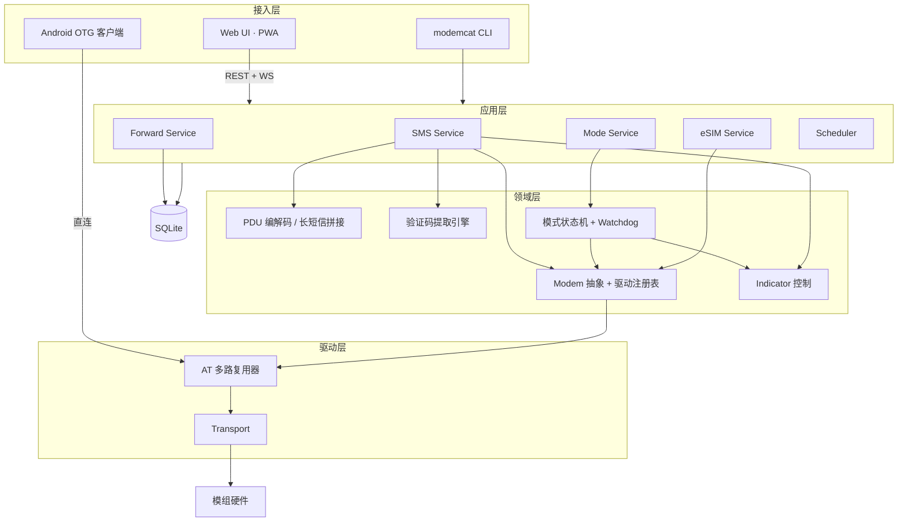
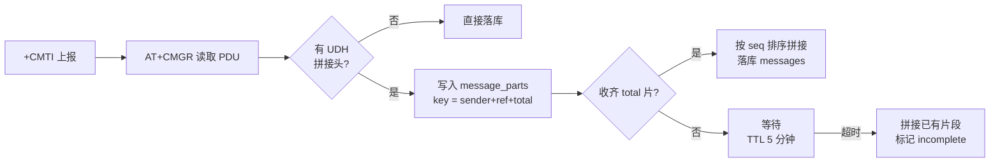
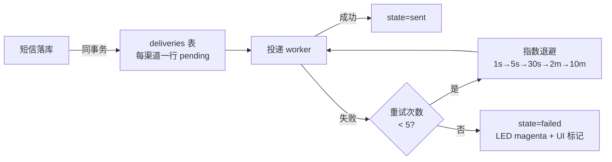
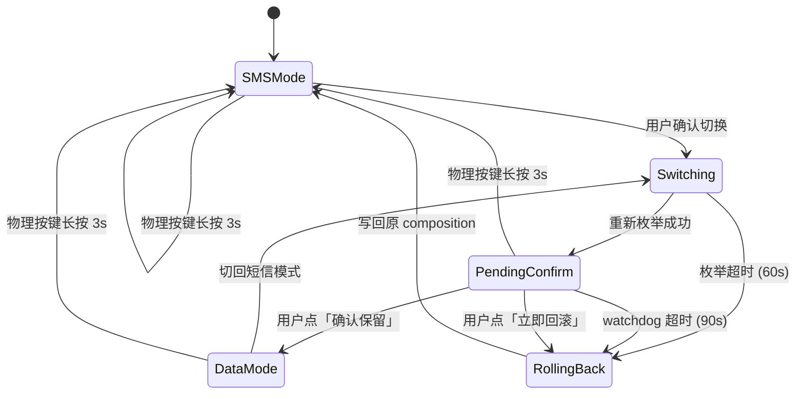
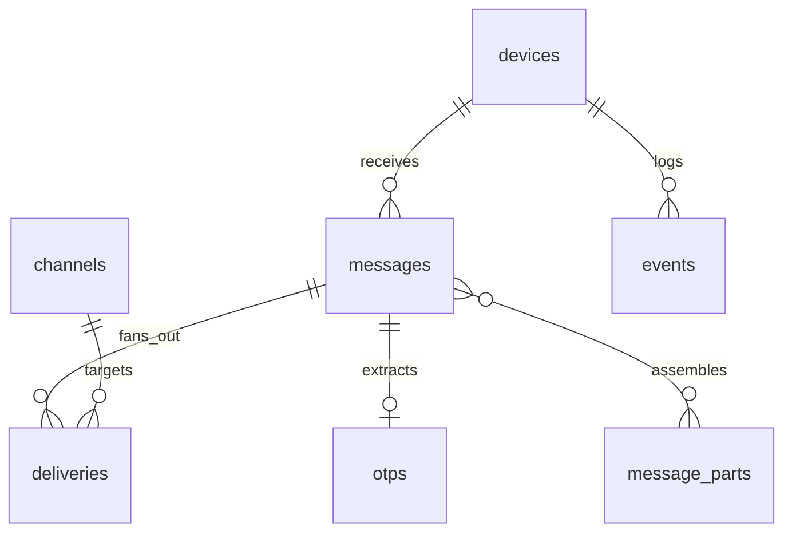

# ModemCat 技术设计

> 开源 4G 模组管理与短信转发中枢
> `github.com/SuInk/modemcat` · 前身 `modemcat`

本文是工程设计，视觉与交互规范见 [设计规范](#) 单独文档。

---

## 1. 目标与非目标

### 做什么

| 能力 | 说明 |
|---|---|
| 模组管理 | 识别、注网状态、信号、SIM 状态、固件信息 |
| 短信 | 接收（PDU）、发送、长短信拼接、会话归档 |
| 验证码 | 从短信正文提取，规则可配置，一键复制 |
| 转发 | 多渠道并行投递，at-least-once，失败重试可见 |
| eSIM | Profile 列举、下载、启用、改名、删除 |
| 网卡类型 | QMI / ECM / MBIM / RNDIS 切换，带自动回滚（**非**短信/上网互斥，见 §6.1）|
| 指示灯 | 模块自带 LED，三档可控；载板 LED 可选全彩（见 §7）|
| 多端 | Web / PWA / Android OTG 直连 |

### 明确不做（v1）

- VoLTE / VoWiFi 通话
- SOCKS5 / HTTP 代理池
- 多设备集群与集中管理（架构留口，v1 单设备）
- 短信内容的云端存储或同步

划出去是为了让 v1 能收敛。代理池和多设备都是 v2 的候选。

### 首发硬件

DJI Cellular Gen 1 —— 核心是 **Quectel EG25-G**，USB `2CA3:4006`，可改写身份为 EC25。第二个驱动目标是原生 EC20/EC25，共用同一套 Quectel AT 实现。

---

## 2. 总体架构



Android 客户端有一条**绕过应用层直连 MUX** 的通路——这是"只有模块和手机"场景的答案，见 §9。

---

## 3. 驱动层

### 3.1 Transport

把"怎么和模组通字节"和"说什么"彻底分开。这是同时支持 Linux 串口、macOS libusb、Android USB 的前提。

```go
type Transport interface {
    Open(ctx context.Context) error
    io.ReadWriteCloser
    Info() TransportInfo // Kind, VID, PID, Path, Serial
}
```

| 实现 | 平台 | 说明 |
|---|---|---|
| `transport/serial` | Linux | `/dev/ttyUSB*`，由 `option` 驱动生成 |
| `transport/libusb` | macOS | 直接 bulk 传输，绕过缺失的内核驱动 |
| `transport/androidusb` | Android | `UsbDeviceConnection.bulkTransfer`，经 gomobile 绑定 |

**热插拔与路径漂移**：切换网卡类型会触发重新枚举（实测约 21 秒），`/dev/ttyUSB2` 可能变成 `ttyUSB5`。不要把路径写进配置。

**注意：该模块的 iSerial 是空字符串**，所以无法按序列号区分同型号的多个设备。匹配策略降级为 `VID:PID + USB 总线拓扑路径`（bus/port chain），Linux 上再附一条 udev 规则生成稳定符号链接 `/dev/modemcat0`。

**宿主机驱动争用**：当 composition 切成 ECM/RNDIS 时，宿主机会自动为它加载网卡驱动（macOS 实测直接生成 `en7`，免驱）。驱动 attach 的瞬间会复位设备，**取消我们在 AT 接口上的在途传输**，表现为 `transfer was cancelled`。

这是一条硬性设计要求，不是偶发故障：

- 所有 AT 传输必须能识别"传输被取消"并**自动重开设备、重新 claim 接口、重放未完成的命令**
- 重新枚举后要留一段静置期（实测 4 秒足够）再发第一条命令，等宿主机驱动 attach 完
- 写配置类命令（`usbnet`、`usbcfg`）必须带重试，实测单次写入有失败概率

### 3.2 AT 多路复用器

**这是最容易写错的部分。** AT 口是单一串行资源，同时有两股数据流：

- **命令响应**：你发 `AT+CSQ`，模组回 `+CSQ: 21,99` 然后 `OK`
- **主动上报（URC）**：模组随时插一句 `+CMTI: "ME",5`（来新短信了）

如果两个 goroutine 同时发命令，响应会串包；如果不把 URC 分流，它会被误读成上一条命令的响应。

```go
type ATPort interface {
    // 串行化执行，独占直到收到终结符或超时
    Do(ctx context.Context, cmd string, opts ...DoOption) (Response, error)
    // URC 按前缀订阅，与命令通道完全分离
    Subscribe(prefix string) <-chan URC
}
```

设计要点：

- **单写者**：所有命令进一条 channel，由一个 writer goroutine 串行发出
- **终结符识别**：`OK` / `ERROR` / `+CME ERROR: n` / `+CMS ERROR: n` / `>`（短信输入提示符）
- **URC 分流**：reader goroutine 收到行后，先匹配已注册的 URC 前缀表，命中则投递到订阅者，否则归当前在途命令
- **默认超时分级**：普通命令 3s，`+CFUN` / `+COPS=?` 这类 60s，写 usbcfg 10s
- **回显处理**：启动时 `ATE0` 关回显，但不能假设成功——parser 要能容忍回显行

### 3.3 Modem 驱动接口

```go
type Modem interface {
    Identify(ctx) (DeviceInfo, error)
    Capabilities() Caps

    SIM(ctx) (SIMStatus, error)
    Network(ctx) (NetStatus, error)

    SMS() SMSPort
    Modes() ModePort   // 仅当 Caps.Has(CapModeSwitch)
    ESIM() ESIMPort    // 仅当 Caps.Has(CapLPA)
}

type Caps uint32
const (
    CapSMS Caps = 1 << iota
    CapModeSwitch
    CapLPA
    CapLEDControl
    CapConcurrentDataSMS  // 上网和短信可同时
)
```

**Caps 是支持多模组的关键。** 前端根据 Caps 隐藏不支持的入口——不是灰掉，是不渲染。一个不支持 eSIM 的模组不该让用户看见 eSIM 标签页。

驱动注册按 `VID:PID` 初筛 + `ATI` / `AT+GMM` 响应确认：

```go
func init() {
    modem.Register(modem.Driver{
        Name:  "quectel-eg25",
        Match: modem.MatchUSB(0x2CA3, 0x4006, 0x2C7C, 0x0125),
        Probe: probeQuectel,   // ATI 里含 "EG25" 或 "EC25"
        New:   newQuectel,
    })
}
```

DJI 变体和原生 EC25 走同一个驱动，差异用 `DeviceInfo.Variant` 标注，只影响 §6 的网卡类型切换实现。

---

## 4. 短信

### 4.1 必须用 PDU 模式

`AT+CMGF=1`（Text 模式）看起来简单，但**处理不了中文和长短信**——UCS2 编码在 Text 模式下的行为各家固件不一致，长短信的 UDH 头拿不到。全程用 `AT+CMGF=0`。

编解码需要覆盖：

- **7-bit GSM 03.38** 打包/解包（含扩展字符表 `€ [ ] { } \ ~ ^ |`）
- **UCS2 (UTF-16BE)** —— 中文短信实际走这个
- **8-bit** —— 少见，但 OTA 配置短信会用
- **UDH 拼接头**：`05 00 03 <ref> <total> <seq>`（8 位 ref）与 `06 08 04 <ref hi> <ref lo> <total> <seq>`（16 位 ref）两种都要支持

### 4.2 长短信拼接



超时后**不丢弃**——拼一条残缺的出来并标记，因为验证码通常在第一片里。丢掉等于用户拿不到码。

### 4.3 去重

模组重启或轮询兜底会导致重复读取。去重键：`sha256(sender + service_center_timestamp + udh_ref + seq)`。不用消息内容做键——同一个发件人发两条一样的短信是合法的。

### 4.4 轮询兜底

URC 会丢（USB 抖动、进程重启期间）。除了监听 `+CMTI`，还要定时 `AT+CMGL=4`（列出全部）扫一遍。间隔默认 60s，可配。

读完要用 `AT+CMGD` 删除模组侧副本，否则 ME 的 23 个槽位满了之后新短信直接收不到——这是最常见的"用着用着就不收短信了"的原因。

**删除的时序是硬约束：必须在落库成功之后。** 删了但没存住等于永久丢失，而存了没删只是浪费一个槽位、下次兜底扫描会被去重挡掉。所以顺序永远是「解码 → 落库 → 确认无错 → 删除」，落库返回任何错误都保留模组副本。长短信的分片同理，分片行提交进 `message_parts` 之后才能删对应索引。

### 4.5 验证码提取

规则引擎，不是硬编码正则。

```yaml
otp_rules:
  - name: cn-generic
    priority: 100
    pattern: '(?:验证码|校验码|动态码|动态密码)[^0-9]{0,10}([0-9]{4,8})'
  - name: cn-code-suffix
    priority: 90
    pattern: '([0-9]{4,8})[^0-9]{0,6}(?:是您的|为您的)?(?:验证码|校验码)'
  - name: en-generic
    priority: 80
    pattern: '(?i)(?:code|otp|pin)[^0-9]{0,10}([0-9]{4,8})'
```

按 priority 依次匹配，首个命中即返回。用户可在设置里增删规则并用历史短信实时预览命中结果——这比让他们盲写正则强得多。

### 4.6 短信可达性：CS 域不可用时必须打开 IMS

LTE 在设计上没有电路交换域，短信只剩两条路：CSFB（回落 2G/3G 走 CS 域）和 SMS over IMS（封装成 SIP 走 IP）。**需不需要 IMS，取决于运营商还有没有 CS 域可退**，而不取决于卡是否漫游：

| 运营商 | CS 域现状 | 短信路径 |
|---|---|---|
| 中国移动 | GSM 2G 仍在运行 | CSFB 可用，IMS 非必需 |
| 中国联通 | 2G/3G 已退网 | 大概率依赖 IMS |
| 中国电信 | CDMA 退网、从无 GSM | **只能走 IMS** |

所以这不是漫游卡的边缘问题——一张普通的国内电信卡同样没有 CS 域可退。

模块 `AutoSel=1` 会按卡和网络选择 MBN。实测这张英国 IMSI（234-33）的卡选中 `ROW_Generic_3GPP`，但在中国电信漫游时将 IMS 配置保持为 Auto（`ims=0,1`）仍能正常接收短信。因此不能把 `ims=0` 当成“IMS 关闭”，也不能仅凭当前 MBN 名称决定是否强制启用。

验证方法：插一张国内卡（先 `AT+QCFG="ims",0` 恢复出厂值），读 `AT+QMBNCFG="list"` 与 `AT+QCFG="ims"`。结论直接决定 `checkSMSReachability` 是兜底功能还是主线功能。

实测那张卡上观察到的出厂状态，三条路同时断开：

```
+QCFG: "nwscanmode",3    锁死 LTE，不回落 —— CSFB 不可能
+CREG: 0,3               网络拒绝 CS 域注册
+QCFG: "ims",0,0         MBN Auto，当前未提供 VoLTE 能力
```

`IMS_conf=0` 表示是否启用由 MBN 决定，`1` 才是强制启用，`2` 是强制禁用。第二个字段是 `VoLTE_cap`，不是 IMS 注册状态。

**程序不改写 IMS 配置，只观测和解释。** 保留 `AT+QCFG="ims",0` 让 MBN 自己决定：Auto 模式能给出 VoLTE 能力时（`ims=0,1`）短信本来就是通的；给不出时，改写会连带影响 VoLTE/VoWiFi 并要求复位模块，这个取舍应该由用户做，不该由初始化流程替他做。

程序的职责是把「短信为什么收不到」讲清楚。`SMSReachability.Remedy` 里直接给出可照做的指令（`AT+QCFG="ims",1` 加重启模块），界面展示，用户自行决定。CS 域保持 `0,3` 被拒不妨碍 SMS over IMS。

演进过程留个记录，两次都值得吸取：

- 最初实现按 PLMN 白名单只对中国电信自动启用。除了会漏掉同样没有 CS 域的卡（联通 2G/3G 已退网，海外 VoLTE-only 运营商同理），这个门槛在 serial 路径上**根本不会命中**——`initModem` 里 `checkSMSReachability` 跑在 `collectDeviceInfo` 之前，而 `AT+COPS=3,2`（切数字格式）在后者里，读到的是 `+COPS: 0,0,"CHN-CT",7` 字母格式，PLMN 正则永远匹配不上。两条路径行为不一致，且失效的那半是静默的。
- 去掉白名单后改为「不可达即自动启用」，覆盖面对了，但方向仍然是替用户改设备配置。最终收敛为只检测不改写。

### 被证伪的假设：CSMS 不是必需的

排查过程中一度得出「还要 `AT+CSMS=1` 才行」的结论，依据是这张表：

| IMS | CSMS | 结果 |
|---|---|---|
| `0,0` | `0` | 收不到 |
| `1,1` | `0` | 收不到 |
| `1,1` | `1` | 收到 |

**这个结论是错的。** 前两行依赖「当时确实有短信发出并被网络投递」这一未经证实的前提，而这点无法回溯核实——「没收到」和「根本没发出去」在接收端完全同形。

受控实验：固定 `ims=1,1`，把 `CSMS` 显式关回 `0`（`+CSMS: 0,1,1,1`），再发一条真实短信。**结果是收到了**（ALIPAY / 347253 / UCS2）。所以 `AT+CSMS=1` 与短信可达性无关，第二行的失败另有原因，最可能就是那次根本没发到。

留在这里是因为教训比结论有用：**在一个「阴性结果和没做实验长得一样」的系统里，连续观测极易被读成因果。** 涉及网络侧行为的结论，必须靠固定其他变量的成对实验来确认，不能靠时间顺序上的相关。

代码里因此**不加** `AT+CSMS=1`——没有证据支持的 AT 指令不进初始化序列。

驱动初始化的两类设置，生命周期不同：

```go
// 持久化 NV，写一次即可，但每次连接都要校验当前值
AT+QCFG="ims",0          // 默认由 MBN 决定，程序不改写

// 会话级，模块每次复位都会掉回默认值，必须每次连接无条件重发
AT+CSMS=1                // 请求 SMS over IP —— 复位后静默回到 0
AT+CNMI=2,1,0,0,0        // 新短信推 +CMTI
AT+CMGF=0                // PDU 模式
AT+CPMS="ME","ME","ME"
```

**`AT+CSMS=1` 是会话级的**，这点必须写进代码注释。它是个极易埋进生产环境的坑：设备重启后短信静默失效，而 `CEREG`、`CSQ`、`CSCA` 所有查询依然全绿，用户只会看到「验证码收不到」这一个症状。

**不要碰 MBN profile。** 选 profile 要按 SIM 的签约归属地，不是按当前驻留网络。实测记录见 §14。

### 4.7 短信可达性是一等状态

数据域注册 ≠ 短信可达。实测中这块模块长时间处于「上网完全正常、短信完全收不到」的状态，而 `+CEREG: 0,5` 会让任何基于注册状态的判断亮绿灯。

判定式：

```
SMSReachable = (CREG ∈ {1,5}) || (IMS_conf != 2 && VoLTE_cap == 1)
```

两条都不满足时，界面必须亮琥珀色告警，并给出可执行的下一步（「IMS 未启用，点此开启」），而不是报一个 `+CREG: 0,3` 让用户自己去查 3GPP 规范。这条覆盖 §7 状态表里「短信模式 · 已就绪」的绿灯条件。

---

## 5. 转发

### 5.1 Notifier 接口

```go
type Notifier interface {
    Name() string
    Validate(cfg json.RawMessage) error
    Send(ctx context.Context, m Message) error
}
```

内置：Telegram、Bark、ntfy、Gotify、Webhook、SMTP、企业微信、飞书、Server 酱、浏览器 Web Push。

### 5.2 投递保证

**at-least-once，用 outbox 表。** 短信落库和投递任务入队在同一个事务里，投递失败不影响短信本身。



重试上限后**不静默丢弃**——转成一个用户可见的失败状态，界面上能一键重投。渠道失败和设备故障用不同颜色（品红 vs 红），因为处置动作不同。

### 5.3 模板

Go `text/template`，每个渠道独立：

```
{{ .Sender }} · {{ .ReceivedAt.Format "15:04:05" }}
{{ .Body }}
{{ if .OTP }}验证码：{{ .OTP }}{{ end }}
```

Webhook 渠道额外支持自定义 JSON body 和 header。

---

## 6. 网卡类型切换

切换会触发设备复位与重新枚举，是产品里唯一有"把自己锁在门外"风险的操作。整个设计按"切换会失败，而且失败时没人能救"来做。

### 6.1 前置问题：不需要切 —— 已实测确认

**结论：短信和上网不互斥，"模式"是个伪命题。** 实测见 §14。

模块当前 composition 为：

```
+QCFG: "usbcfg",0x2CA3,0x4006,1,1,1,1,1,0,0
         vid     pid    diag nmea at modem rmnet adb uac
```

`at_port=1` 与 `rmnet=1` **本来就同时开着**——AT 口（if2）和网卡（if4）并存枚举。用户不需要为了收短信而放弃上网。

原项目所谓的 Mode 0 / Mode 1，实际切的是 `AT+QCFG="usbnet",<0-3>`——网卡的**协议风味**（0=QMI/RMNET、1=ECM、2=MBIM、3=RNDIS），不是开关 AT 口。已实测切到 ECM 再切回，AT 口全程存在。

因此产品上的正确表述不是"模式切换"，而是**"网卡类型"**，属于设置页的高级项，不该占据概览页的主位置。下面的状态机与回滚机制**仍然保留**，因为切换过程中的设备复位是真实的（约 21 秒重新枚举），但它从核心流程降级为一个低频设置项。

### 6.2 状态机



**确认必须由用户点击产生。** 不能用"守护进程还活着"或"ping 通了"来推断成功——守护进程活着不等于用户还能上网，而用户能不能上网只有用户知道。

### 6.3 三道保险

| 层 | 机制 | 在什么情况下还有效 |
|---|---|---|
| 软件 | 90s watchdog 自动写回原 composition | 守护进程存活 |
| 硬件 | 载板按键长按 3s，无条件切回 | 守护进程崩溃 |
| 观测 | LED 自述当前模式与切换中状态 | 界面完全打不开 |

物理按键走独立的 GPIO watcher 路径，**不经过应用层任何逻辑**——它是最后一道，必须在别的东西都坏了的时候还能用。

### 6.4 API 契约

```
POST /api/v1/device/mode        {"mode":"data"}
  → 200 {"switch_id":"sw_01H…","expires_at":"2026-08-04T14:06:30Z"}

POST /api/v1/device/mode/confirm  {"switch_id":"sw_01H…"}
  → 200 {"mode":"data","confirmed":true}

POST /api/v1/device/mode/rollback {"switch_id":"sw_01H…"}
  → 200 {"mode":"sms"}
```

`switch_id` 是一次性的，过期后 confirm 返回 `409 switch_expired`。

---

## 7. 指示灯

**指的是大疆模块自带的那颗灯，不是载板上外接的。** 这个约束大幅收窄了可做的事。

实测该固件只暴露一个开关：

```
+QCFG: "ledmode",(0-2)      当前值 0
```

三档，且由模组固件按自己的逻辑驱动（通常是注网状态），**主机无法逐帧控制颜色与闪烁节奏**。设计规范里那套六色 × 五种节奏的系统，在裸模块上做不到——它需要载板上一颗主机可控的 LED。

因此指示灯分两条产品线：

| 场景 | 能力 | 实现 |
|---|---|---|
| 裸模块（默认） | `ledmode` 三档，语义由固件定义 | `indicator/atled` |
| 自制载板（可选） | 完整六色 × 五节奏 | `indicator/gpio`、`indicator/ws2812` |

```go
type Indicator interface {
    Set(DeviceState) error
    Capabilities() IndicatorCaps  // 主机是否可控颜色/节奏
    Close() error
}
```

`Capabilities()` 让界面知道该显示什么：裸模块上不要渲染"指示灯颜色说明"这种用户对不上号的图例。

> **待验证**：`ledmode` 的 0/1/2 各自对应什么行为，Quectel 手册未公开描述，需要逐档设置并肉眼观察模块上的灯。这需要人在设备旁边，不能靠脚本判定。

**状态到信号的映射表在代码里只有一份**，前端状态胶囊和 LED 从同一份定义取值，`atled` 实现负责把它降级映射到三档里最接近的一档。这样不会出现"灯和界面说两种话"。

```go
var stateMap = map[DeviceState]Signal{
    StateSMSReady:  {Color: Green,   Pattern: Solid},
    StateDataReady: {Color: Blue,    Pattern: Solid},
    StateSearching: {Color: Amber,   Pattern: Blink1Hz},
    StateNewSMS:    {Color: White,   Pattern: Burst3},
    StateFwdFailed: {Color: Magenta, Pattern: DoubleBlink},
    StateNoSIM:     {Color: Red,     Pattern: Solid},
    StateOffline:   {Color: Off,     Pattern: Off},
}
```

---

## 8. 数据模型

SQLite，单文件，WAL 模式。



| 表 | 关键字段 | 索引 |
|---|---|---|
| `devices` | id, vid, pid, serial, variant, last_seen | uniq(vid,pid,serial) |
| `messages` | id, device_id, sender, body, encoding, received_at, dedup_key, incomplete | uniq(dedup_key), idx(received_at desc) |
| `message_parts` | dedup_group, ref, seq, total, payload, expires_at | idx(dedup_group) |
| `otps` | message_id, code, rule_name | idx(message_id) |
| `channels` | id, kind, name, config_json, enabled | — |
| `deliveries` | id, message_id, channel_id, state, attempts, next_retry_at, last_error | idx(state, next_retry_at) |
| `schedules` | id, cron, action_json, enabled, last_run | — |
| `events` | id, device_id, level, kind, payload, at | idx(at desc) |

**保留策略**：`messages` 默认保留 90 天，`events` 保留 14 天，`message_parts` 过期即删。可在设置里调，也可关闭自动清理。

---

## 9. 接入层

### 9.1 HTTP API

REST 写 + WebSocket 单向推。前缀 `/api/v1`。

```
GET    /device                     设备与网络状态
POST   /device/mode                切模式（见 §6.4）
GET    /messages?cursor=&limit=    游标分页
POST   /messages                   发送短信
GET    /channels                   转发渠道
POST   /channels/:id/test          渠道自检
GET    /esim/profiles              eSIM Profile 列表
POST   /esim/profiles              下载 Profile（activation code）
POST   /at                         AT 调试，需显式开启
WS     /stream                     事件推送
```

**`/at` 默认关闭。** 它能刷写 usbcfg、改 IMEI、清 SIM——是个完整的越权面。开启需要在设置里显式打开并二次确认，且只在本地回环或已认证会话可用。

### 9.2 鉴权

单用户模型。首次启动生成一次性 setup token 打在 stdout 和 LED（白色长闪），设置密码后换成 session cookie（HttpOnly + SameSite=Strict）。API 另发长期 token 供脚本使用，可撤销。

### 9.3 前端

一套响应式 PWA 覆盖 Web 和移动，构建产物用 `embed.FS` 打进 Go 二进制——单文件部署是这类自托管工具的核心体验。

- 桌面展开左侧栏，移动收成四个底部标签
- eSIM / AT / 日志收进「设备」二级，防止在移动端误触模式切换
- Web Push 作为一个转发渠道接入，复用 Notifier 接口

### 9.4 Android OTG 直连

"只有模块和手机，没有电脑"的场景。三条路，按优先级：

| 方案 | 可行性 | 说明 |
|---|---|---|
| **WebUSB** | 待实测 | Chrome on Android 支持。页面直接 claim 接口做 bulk 传输，零安装。需 HTTPS + 用户手势，且内核 `option` 驱动未抢占该接口 |
| **原生客户端** | 确定可行 | `UsbManager` + `usb-serial-for-android`，把 `2CA3:4006` 注册进 CdcAcm probe table，免 root。核心逻辑用 gomobile 复用 Go 实现 |
| **通用串口 App** | 应急 | 手打 AT，不算产品能力，写进文档兜底 |

iOS 没有开放的 USB host 串口能力，**不做**。iPhone 用户走 §10 的小主机方案。

> WebUSB 实测是 M3 的第一件事。成了就是杀手锏——插上 OTG 打开网页就能切模式，比装 App 门槛低一个数量级。

---

## 10. 部署形态

| 形态 | 目标用户 | 说明 |
|---|---|---|
| 单二进制 + SQLite | 主流 | Linux / macOS，`./modemcatd` 直接跑 |
| Docker | 服务器 | 需 `--device=/dev/modemcat0` 或映射 USB bus |
| OpenWrt ipk | 路由器 | 交叉编译 mipsel / aarch64，最省电的常驻方案 |
| ESP32-S3 固件 | 随身盒子 | 后续。精简 C 实现，只做 AT + WiFi AP + LED，手机连 WiFi 开网页 |

ESP32-S3 方案是"只有模块和手机"的**最优产品化答案**——约 ¥20，带 USB-OTG host 能驱 CDC-ACM，手机只当浏览器，不需要 WebUSB 也不需要装 App。

---

## 11. 目录结构

```
modemcat/
├─ cmd/
│  ├─ modemcatd/          守护进程
│  └─ modemcat/           CLI（发短信、查状态、切模式）
├─ internal/
│  ├─ transport/          serial · libusb · androidusb
│  ├─ atport/             多路复用 · URC 路由 · 响应解析
│  ├─ modem/              接口 + 驱动注册表
│  │  ├─ quectel/         eg25 · ec25（含 DJI 变体）
│  │  └─ generic/         纯 AT 兜底驱动
│  ├─ sms/                pdu · gsm7 · concat · otp
│  ├─ notify/             telegram · bark · ntfy · webhook · smtp · …
│  ├─ mode/               状态机 · watchdog
│  ├─ indicator/          gpio · ws2812 · atled · noop
│  ├─ store/              sqlite · migrations
│  ├─ api/                http · ws · auth
│  └─ config/
├─ web/                   前端源码，构建产物 embed
├─ android/               OTG 客户端（gomobile 绑定）
├─ firmware/esp32s3/      后续
└─ docs/
```

`internal/` 而非 `pkg/`——v1 不承诺任何外部 API 稳定性。

---

## 12. 路线图

| 里程碑 | 内容 | 验收 |
|---|---|---|
| **M0** | usbcfg 组合模式实测；Transport + ATPort 骨架 | 能在 Linux 上稳定跑通 `AT+CSQ` 一万次不串包；给出 usbcfg 可用取值清单 |
| **M1** | Modem 接口 + Quectel 驱动 + PDU 收发 + SQLite；仓库改名迁移 | 中文长短信收发正确；`go.mod` 与镜像名全量迁移完成 |
| **M2** | 模式状态机 + watchdog + Indicator + 物理按键 | 拔掉网线模拟失败，90s 后自动回滚成功 |
| **M3** | Notifier 全套 + outbox 重试 + PWA 前端 | 断开 Telegram 后恢复，积压消息全部补投；PWA 可安装 |
| **M4** | eSIM + 定时任务 + Android OTG（WebUSB 或原生） | 手机单独完成一次模式切换 |

改名放在 M1 而非 M0——先让核心链路跑通，再一次性做迁移，避免在两个模块路径之间来回。

---

## 13. 风险

| 风险 | 影响 | 应对 |
|---|---|---|
| ~~usbcfg 无同时枚举的组合~~ | — | **已排除**，见 §6.1 |
| 宿主机网卡驱动争用取消 AT 传输 | 切换网卡类型时命令随机失败 | 传输层自动重开 + 重放，见 §3.1 |
| iSerial 为空 | 多设备无法区分 | 按 USB 总线拓扑路径匹配 |
| CS 域注册被拒 (`+CREG: 0,3`) | 可能收不到短信 | 待实测：等一条真实短信；查 `AT+CEREG?` 与 IMS 状态 |
| 该固件可能无 LPA 指令 | eSIM 功能整体落空，M4 缩水 | `AT+QCFG=?` 未见 eSIM 子命令，需单独探测 |
| ME/SIM 短信存储写满 | 静默停止收短信 | 读后立即 `AT+CMGD`，并监控 `AT+CPMS` 占用 |
| WebUSB 被 option 驱动抢占 | Android 零安装方案失效 | 降级到原生客户端，M4 备选路径 |
| DJI 固件拒绝部分 AT | 功能按变体缺失 | Caps 位标记，前端按能力渲染 |
| eSIM LPA 实现复杂度 | M4 延期 | 优先只做「列举 + 启用」，下载走 activation code 透传 |

---

## 14. 实测记录

设备：DJI Cellular Gen 1，macOS 26，libusb 1.0.30 + gousb。

### 硬件事实

```
USB          2CA3:4006   class ef   iSerial ""(空)
ATI          Baiwang / QDC507 / Revision: QDC507GLEFM21
IMEI         863212*********
接口布局      if0 DM(ff/ff/ff) · if1 NMEA · if2 AT · if3 modem · if4 RMNET
usbcfg       0x2CA3,0x4006,1,1,1,1,1,0,0
usbnet       0  (QMI/RMNET)
ledmode      0  (可选 0-2)
```

固件是 Quectel EG25/EC25 系的 AT 实现（`AT+QCFG=?` 的子命令集可确认），但厂商字符串被改成了 Baiwang，型号 QDC507。

### 网络与 SIM

```
+CPIN: READY          IMSI 23433**********  (MCC 234 = 英国)
+CSQ: 30,99           RSSI −53 dBm
+COPS: 0,0,"CHN-CT",7 +QNWINFO: "FDD LTE","46011","LTE BAND 3",1550
+CREG:  0,3           CS 域注册被拒
+CGREG: 0,5           PS 域已注册（漫游）
+CPMS: "ME",0,23      短信存储仅 23 槽
+CMGF: 0              已是 PDU 模式
```

英国 IMSI 漫游在中国电信网上（`+QSPN` 显示 CTExcel，中国电信的英国 MVNO），数据域正常、CS 域被拒。短信最终通过 IMS 路径送达，解法见 §4.6。

### MBN profile：踩过的坑

模块固件自带 20 个运营商 MBN 配置，出厂由 `AutoSel` 自动选中 `ROW_Generic_3GPP`。因为 SIM 驻留在中国电信，我曾判断应该换成固件里现成的 `VoLTE_OPNMKT_CT`（中国电信 VoLTE）。**这是错的，并且会直接打断数据附着：**

```
AT+QMBNCFG="select","VoLTE_OPNMKT_CT"  → 复位后
+CREG: 0,2  +CEREG: 0,2       从「已注册」退化成「搜索中」
+EMM ERROR: 19                 EMM #19 = ESM failure
+ESM ERROR: 1,33               ESM #33 = requested service option not subscribed
+COPS: 0                       无运营商，附着失败
```

原因：**选 MBN 要按 SIM 的签约归属地，不是按当前驻留网络。** 这张卡签约在英国，驻留中国电信只是漫游；套上电信国内的 APN/PDN 参数，等于拿英国合同去要国内套餐，网络回「未签约」是正确行为。改动前是「上网通、短信不通」，改完变成两个都不通。

而且完整列表里**没有任何英国/欧洲通用的 VoLTE profile**（只有美、日、韩、德、西、澳、印和中国三家），`ROW_Generic_3GPP` 已经是最优解。

**结论：MBN profile 一律不动，保持 `AutoSel=1`。** 这条要作为明确禁令写进驱动，否则后来者会重复这个推理。

### 短信收取链路实测 ✓

先用 `AT+QCFG="ims",1` 验证 IMS 路径，再恢复 `AT+QCFG="ims",0`（MBN Auto）。两种配置下真实短信收取全链路都已跑通，最终保留 Auto：

```
[URC] +CMTI: "ME",0
发件人  ALIPAY          编码 UCS2
验证码  ******          规则 cn-generic
正文    注册验证码：******。【示例发送方】
SCTS    2026-08-05 13:34:37 +01:00
```

模块吐回的原始 PDU 一条就覆盖了两条非平凡分支：

```
07 91 ************   SMSC 已脱敏
24                   MTI=DELIVER, TP-SRI=1
0B D0 4166121ACC02   TOA=0xD0 → 类型位 5 = 字母数字地址
                     6 字节 GSM7 打包解出 "ALIPAY"
00 08                PID / DCS=0x08 = UCS2
62805031437340       SCTS，时区 +01:00（英国夏令时，与 UK SMSC 一致）
3E                   UDL 62 字节
```

**字母数字发件人**（`ALIPAY` 打包在地址字段里，不是号码）和 **UCS2 中文正文**都正确解出。单元测试里这两条是分开造的向量，真机一条把两个都覆盖了。

已验证：URC 分流（`+CMTI` 没被当成命令响应吞掉）· `AT+CMGR` 读取 · PDU 解码 · 落库 · 验证码提取 · 60 秒轮询兜底 · 去重（兜底重读同一条被正确忽略）· 读后 `AT+CMGD` 删除模组副本（删除后多个轮询周期不再重复命中）。

### usbnet 切换实测

`AT+QCFG="usbnet",1` → `AT+CFUN=1,1` → 21 秒重新枚举，composition 从 5 接口变 6 接口：

```
if4  class 02/06/00   CDC ECM 控制
if5  class 0a/00/00   CDC Data (alt1 带 2 个 bulk)
if2  class ff/00/00   AT 口 —— 仍在
```

macOS 免驱识别为网卡 `en7`（`4a:f2:1a:77:ec:0c`，UP/RUNNING）。随后 AT 传输被取消——宿主机驱动 attach 复位设备所致，见 §3.1。已写回 `usbnet=0` 并确认恢复原状。

**ECM 比 QMI 更适合做默认值**：macOS、Linux、Windows 都免驱，而 QMI 在 macOS 上完全不可用。建议 M2 把默认网卡类型定为 ECM，QMI 留给需要它的 Linux 用户。

### macOS libusb：空闲读取的错误语义

空闲的 bulk IN 读取超时，在 macOS libusb 上报的是 **`TransferCancelled`，不是 `context.DeadlineExceeded`**。任何常驻监听 URC 的实现如果只判断 deadline，都会在第一次空闲超时误判成设备掉线——而这在 Linux 上不会暴露，因为那边读的是 `/dev/ttyUSB*` 串口，语义完全不同。

读循环必须把 `TransferCancelled` / `TransferTimedOut` 一并当成「暂时没数据」。

### 尚未验证

- `ledmode` 0/1/2 各自的行为（需人在设备旁肉眼观察）
- 短信**发送**（`AT+CMGS` 两段式交互 + PDU 编码，目前只验证了接收）
- 长短信拼接的真机验证（解码器单测覆盖了 UDH，但没收过真实多片短信）
- eSIM / LPA 指令是否存在
- Linux 下 `option` 驱动 + `/dev/ttyUSB*` 路径

---

## 15. 待定

- 前端框架：现仓库有 `frontend` 与 `frontend-next` 两份，需确认保留哪个作为 PWA 基线
- ESP32-S3 固件是否复用 Go（TinyGo 对 USB host 支持有限）还是纯 C（ESP-IDF）
- 是否在 v1 就引入插件机制（Notifier 动态加载），还是全部编译进二进制
